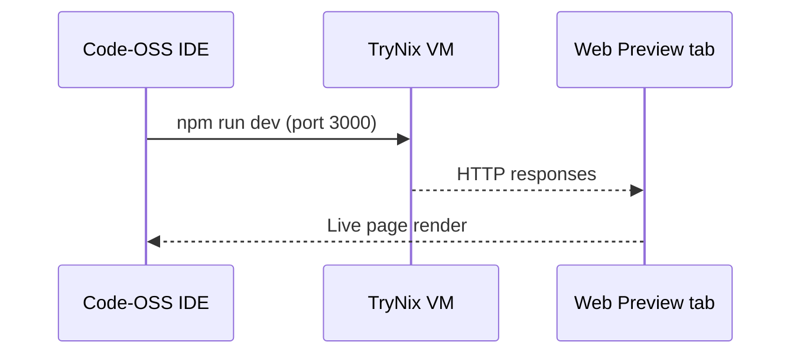

# Next.js Web Preview

This module demonstrates launching a full **Next.js** development server inside the TryNix Linux environment and viewing the live output in the Web Preview tab.

## How it works

When you run `npm run dev` in the terminal:
1. Next.js starts on port **3000** inside the Linux VM.
2. The platform exposes that port and opens the **Web Preview** tab.
3. Every file save triggers Next.js hot-reload — visible instantly in the preview.

> **Tip**: The workspace terminal is fully interactive. You can run any shell command, install packages with `npm install`, and restart the dev server at will.
