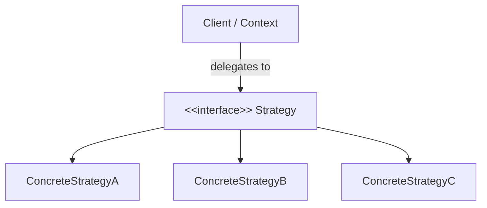

# Strategy Pattern Overview

The Strategy Pattern enables you to define a family of algorithms, encapsulate each one as an independent collaborator, and make them interchangeable at runtime.

By separating the invariant workflow orchestration from volatile algorithmic or policy choices, your domain logic remains closed for modification yet open for extension.

## Architecture & Structure

## Computational Complexity & Invariants

Using dedicated policy collaborators guarantees stable runtime characteristics:
$$\text{Cost}(n) = \mathcal{O}(1) \quad \text{vs} \quad \mathcal{O}(k \cdot n)$$
$$\sum_{i=1}^n \text{policy}_i(x) \le \text{Threshold}$$

In this module, you will:
1. **Identify stable roles**: isolate orchestration interfaces from concrete channel implementations.
2. **Handle changing policies**: model variable pricing and discount strategies as interchangeable policy collaborators.
3. **Connect policies to checkout**: inject policy collaborators into cart and checkout workflows.
4. **Integrate the complete workflow**: coordinate policy, state, and presentation into an end-to-end service.

